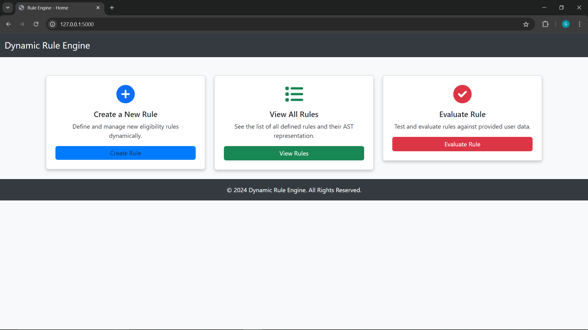
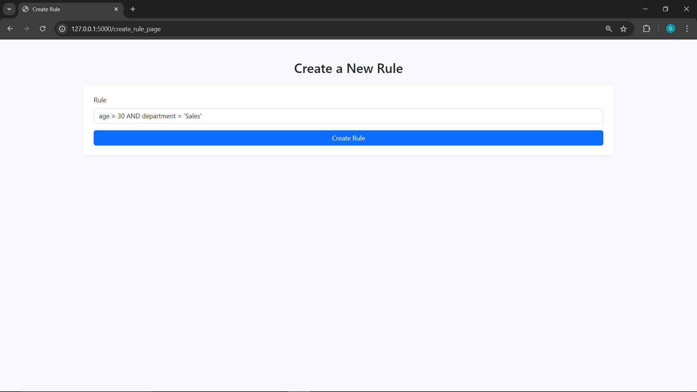
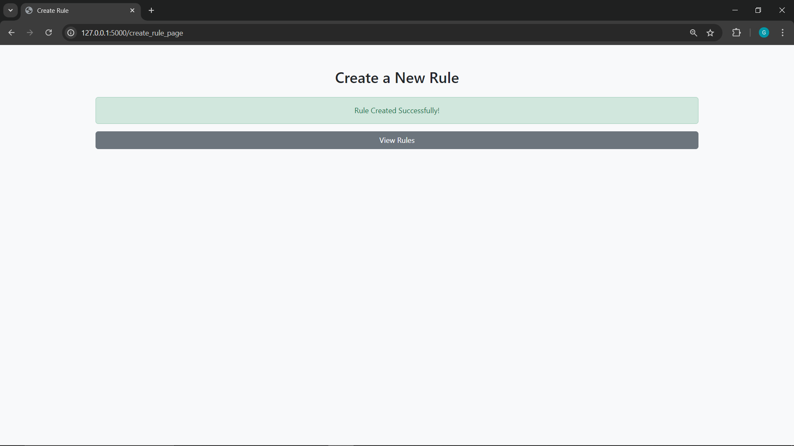
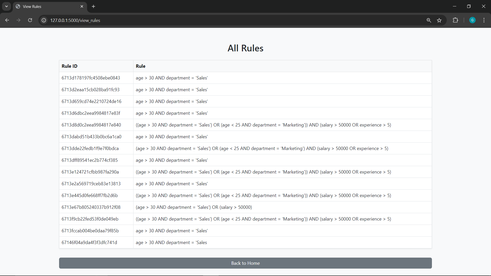
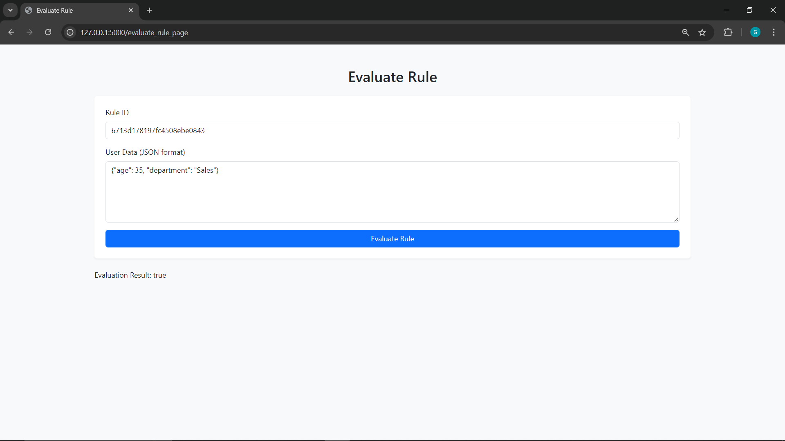

# Dynamic Rule Engine with AST

This project implements a dynamic rule engine application using Abstract Syntax Trees (AST) to evaluate rules based on user attributes such as age, department, salary, and experience.

## Table of Contents
- [Objective](#objective)
- [Features](#features)
- [Technologies Used](#technologies-used)
- [Setup and Installation](#setup-and-installation)
- [Usage](#usage)
  - [Creating Rules](#creating-rules)
  - [Viewing Rules](#viewing-rules)
  - [Evaluating Rules](#evaluating-rules)
- [Screenshots](#screenshots)
  - [1. Home Page](#1-home-page)
  - [2. Create Rule Page](#2-create-rule-page)
  - [2.1 Rule Submission Success](#21-rule-submission-success)
  - [3. View Rules Page](#3-view-rules-page)
  - [4. Evaluate Rule Page](#4-evaluate-rule-page)
- [Conclusion](#conclusion)
- [License](#license)

## Objective
The purpose of this project is to develop a simple 3-tier dynamic rule engine that uses AST to represent conditional rules. The application allows for the dynamic creation, combination, and evaluation of rules to determine user eligibility based on various attributes.

## Features
- **Create Dynamic Rules**: Define conditional rules and store them in MongoDB.
- **Combine Rules**: Use logical operators (AND/OR) to combine rules.
- **Evaluate Rules**: Provide user data in JSON format to evaluate against the defined rules.
- **Responsive UI**: Built using HTML/CSS and Bootstrap for easy navigation.

## Technologies Used
- **Backend**: Python (Flask)
- **Database**: MongoDB for rule storage
- **Frontend**: HTML, CSS, Bootstrap
- **JavaScript**: For dynamic functionality on the frontend

## Setup and Installation

### Prerequisites
1. Python 3.x
2. MongoDB installed locally or on a remote server (e.g., MongoDB Atlas)
3. `pip` (Python package installer)

### Installation Steps
1. Clone the repository:
    ```bash
    git clone https://github.com/Gokuluvarajofficial/rule_engine_with_ast.git
    cd rule_engine_with_ast
    ```
2. Create a virtual environment and activate it:
    ```bash
    python -m venv venv
    source venv/bin/activate   # On Windows: venv\Scripts\activate
    ```
3. Install dependencies:
    ```bash
    pip install -r requirements.txt
    ```
4. Start the MongoDB server if not running.

5. Run the Flask application:
    ```bash
    python ast_rule_engine.py
    ```
6. Open your browser and go to:
    ```
    http://127.0.0.1:5000
    ```

## Usage

### Creating Rules
1. Navigate to the "Create Rule" page.
2. Enter the rule string (e.g., `age > 30 AND department = 'Sales'`).
3. Click on the "Create Rule" button.

### Viewing Rules
1. Navigate to the "View Rules" page to see a list of all created rules.
2. Each rule displays a unique Rule ID and the rule string.

### Evaluating Rules
1. Navigate to the "Evaluate Rule" page.
2. Enter the Rule ID and the user data in JSON format (e.g., `{ "age": 35, "department": "Sales" }`).
3. Click "Evaluate" to get the result (True/False).

## Screenshots

### 1. Home Page


### 2. Create Rule Page


### 2.1 Rule Submission Success


### 3. View Rules Page


### 4. Evaluate Rule Page


---

## Conclusion
This project demonstrates a simple but effective rule engine using AST to evaluate user attributes. It's flexible, extensible, and provides a dynamic way of handling eligibility checks through rule definitions. Feel free to extend the functionality or add more complex validation and security features for future use cases.

---

## License
This project is licensed under the MIT License - see the LICENSE file for details.
